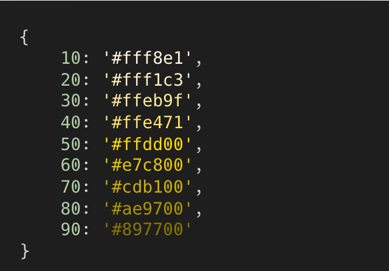

# generate-palette

Generate a color palette based on an input color and step value.

## Installation

This package is available on [npm](https://www.npmjs.com/).

### Install locally:

```sh
npm install generate-palette
```  

### Install globally:

```sh
npm install -g generate-palette
```  

## TypeScript Support

This package includes TypeScript type definitions for improved auto-completion and type safety.

To ensure compatibility, install the Node.js type definitions:

```sh
npm install @types/node
```  

## Usage

### Importing the module

```js
const generatePalette = require('generate-palette');
```

### API

#### `generatePalette(color, step) → Object`

Generates a color palette based on the given color and step value.

##### Parameters:
- **`color`** (string) – The base color in HEX format.
- **`step`** (number, optional) – The intensity step for the palette, ranging from `0` to `100`.

##### Returns:
An object containing the generated color palette.

## Examples

### Example: Generate a color palette in JavaScript

```js
const generatePalette = require('generate-palette');

const palette = generatePalette('#FFDD00', 10);
console.log(palette);
```  

  

### Example: CLI Usage

#### Generate a palette using the CLI

```sh
generate-palette --color '#87CEEB' --step 10
```  

#### Output results in JSON format

```sh
generate-palette --color '#FFDD00' --step 10 --json
```  

## License

This project is licensed under the [MIT License](LICENSE).
